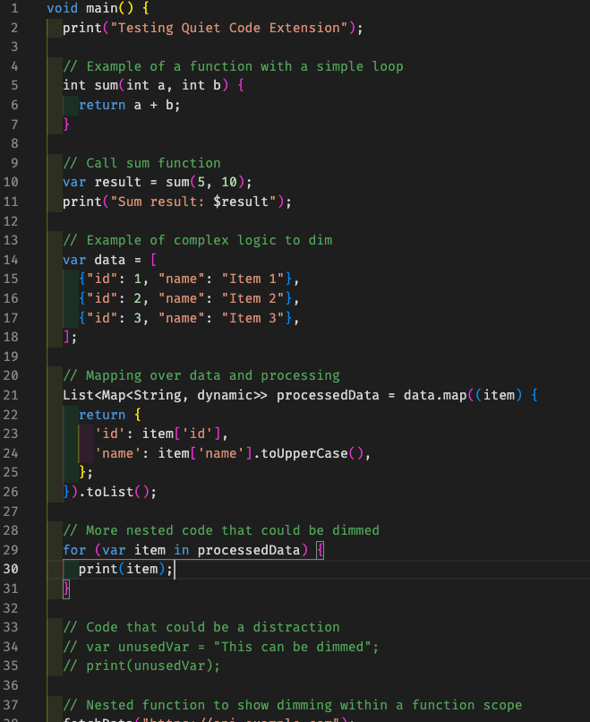
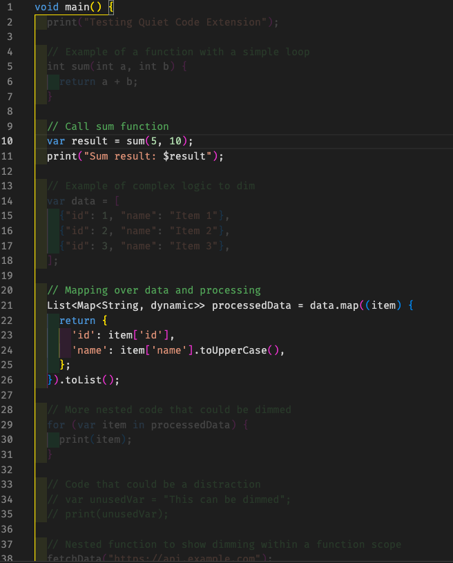
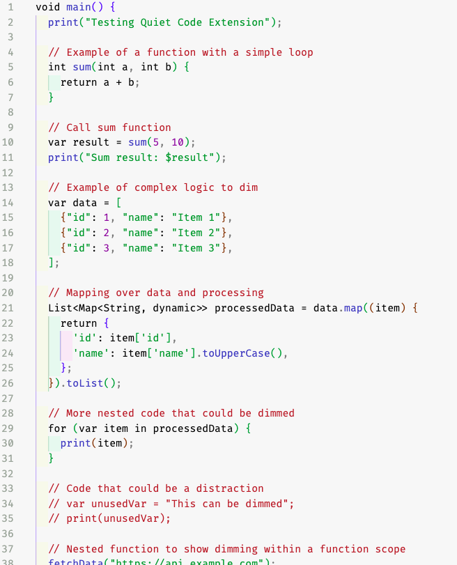
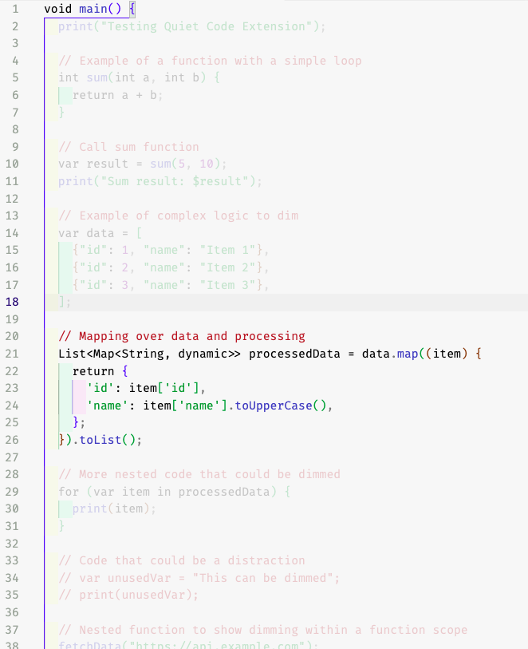

# Quiet Code

Quiet Code lets you dim selected lines in your code editor to reduce visual clutter.

Ideal for:

- Tracing data flow
- Simplifying complex files
- Focusing on the logic you care about

---

## Features

- Select any line(s) and toggle dimming with `Cmd+Shift+1`
- Clear all dims in the current file with `Cmd+Shift+2`
- Clear all dims across all files with `Cmd+Shift+0`
- Dim styling is subtle and non-destructive — your code stays clean

**On dark theme**

**On light theme**

## Why?

Sometimes, the hardest part of reading code is ignoring what you don’t need.

Quiet Code gives you a soft focus tool — think of it like a spotlight for your mind.

---

## Keybindings

| Command                    | Shortcut        |
| -------------------------- | --------------- |
| Toggle Dim                 | Cmd + Shift + 1 |
| Clear Dims in Current File | Cmd + Shift + 2 |
| Clear All Dims             | Cmd + Shift + 0 |

---

## Getting Started

1. Select lines of code
2. Hit `Cmd + Shift + 1` to toggle dim
3. To remove dims, use the same keybinding or clear them with `Cmd + Shift + 2`

---

## Tip

You can also trigger commands from the Command Palette:

- `Quiet Code: Toggle Dim`
- `Quiet Code: Clear Dims in File`
- `Quiet Code: Clear All Dims`

---

Made with care by minlabs 💛
If you have feedback or ideas for improvement, I’d love to hear from you directly.  
You can email pkhanthee@gmail.com
